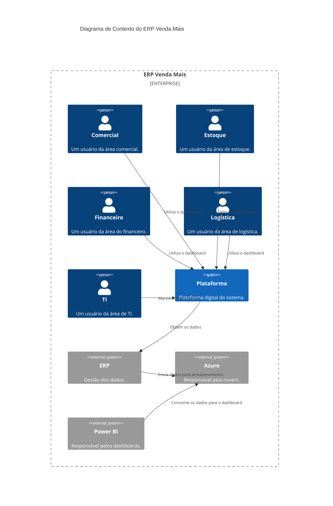

```mermaid
C4Context
    title Diagrama de Contexto do ERP Venda Mais

    Enterprise_Boundary(erpsistema, "ERP Venda Mais") { 
        Person(comercial, "Comercial", "Um usuário da área comercial.")
        Person(estoque, "Estoque", "Um usuário da área de estoque.")
        Person(financeiro, "Financeiro", "Um usuário da área do financeiro.")
        Person(logistica, "Logística", "Um usuário da área de logística.")
        Person(ti, "TI", "Um usuário da área de TI.")

        System(plataforma, "Plataforma", "Plataforma digital do sistema.")
        System_Ext(erp, "ERP", "Gestão dos dados.")
        System_Ext(azure, "Azure", "Responsável pela nuvem.")
        System_Ext(powerbi, "Power BI", "Responsável pelos dashboards.")

        Rel(comercial, plataforma, "Utiliza o dashboard")
        Rel(estoque, plataforma, "Utiliza o dashboard")
        Rel(financeiro, plataforma, "Utiliza o dashboard")
        Rel(logistica, plataforma, "Utiliza o dashboard")
        Rel(ti, plataforma, "Mantém e dá suporte")

        Rel(plataforma, erp, "Obtém os dados")
        Rel(erp, azure, "Envia dados para armazenamento")
        Rel(powerbi, azure, "Consome os dados para o dashboard")
    }
```

