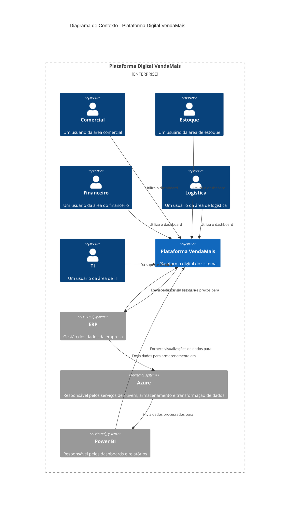

```mermaid
C4Context
    title Diagrama de Contexto - Plataforma Digital VendaMais

    Enterprise_Boundary(erpsistema, "Plataforma Digital VendaMais") { 
        Person(comercial, "Comercial", "Um usuário da área comercial")
        Person(estoque, "Estoque", "Um usuário da área de estoque")
        Person(financeiro, "Financeiro", "Um usuário da área do financeiro")
        Person(logistica, "Logística", "Um usuário da área de logística")
        Person(ti, "TI", "Um usuário da área de TI")

        System(plataforma, "Plataforma VendaMais", "Plataforma digital do sistema")
        System_Ext(erp, "ERP", "Gestão dos dados da empresa")
        System_Ext(azure, "Azure", "Responsável pelos serviços de nuvem, armazenamento e transformação de dados")
        System_Ext(powerbi, "Power BI", "Responsável pelos dashboards e relatórios")

        Rel(comercial, plataforma, "Utiliza o dashboard")
        Rel(estoque, plataforma, "Utiliza o dashboard")
        Rel(financeiro, plataforma, "Utiliza o dashboard")
        Rel(logistica, plataforma, "Utiliza o dashboard")
        Rel(ti, plataforma, "Dá suporte técnico")

        Rel(plataforma, erp, "Envia pedidos/vendas para")
        Rel(erp, plataforma, "Fornece dados de estoque e preços para")
        Rel(erp, azure, "Envia dados para armazenamento em")
        Rel(azure, powerbi, "Envia dados processados para")
        Rel(powerbi, plataforma, "Fornece visualizações de dados para")

        UpdateLayoutConfig($c4ShapeInRow="3", $c4BoundaryInRow="1")
    }
```

