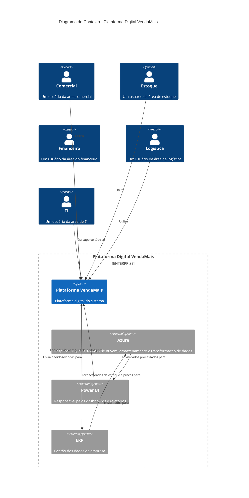

```mermaid
C4Context
    title Diagrama de Contexto - Plataforma Digital VendaMais

    Person(comercial, "Comercial", "Um usuário da área comercial")
    Person(estoque, "Estoque", "Um usuário da área de estoque")
    Person(financeiro, "Financeiro", "Um usuário da área do financeiro")
    Person(logistica, "Logística", "Um usuário da área de logística")
    Person(ti, "TI", "Um usuário da área de TI")

    Enterprise_Boundary(erpsistema, "Plataforma Digital VendaMais") { 
        System(plataforma, "Plataforma VendaMais", "Plataforma digital do sistema")

        System_Ext(azure, "Azure", "Responsável pelos serviços de nuvem, armazenamento e transformação de dados")
        System_Ext(powerbi, "Power BI", "Responsável pelos dashboards e relatórios")
        System_Ext(erp, "ERP", "Gestão dos dados da empresa")
    }

    %% Relação entre atores
    Rel(comercial, plataforma, "Utiliza")
    Rel(estoque, plataforma, "Utiliza ")
    Rel(financeiro, plataforma, "Utiliza")
    Rel(logistica, plataforma, "Utiliza")
    Rel(ti, plataforma, "Dá suporte técnico")

    %% Relação entre sistemas
    Rel(plataforma, erp, "Envia pedidos/vendas para")
    Rel(erp, plataforma, "Fornece dados de estoque e preços para")
    Rel(erp, azure, "Envia dados para")
    Rel(azure, powerbi, "Envia dados processados para")
    Rel(powerbi, plataforma, "Fornece visualizações de dados para")

    %% Estilização das relações
    UpdateRelStyle(comercial, plataforma, $offsetX="0", $offsetY="-210")
    UpdateRelStyle(ti, plataforma, $offsetX="0", $offsetY="-50")

    UpdateRelStyle(plataforma, erp, $offsetX="-150", $offsetY="-40")
    UpdateRelStyle(erp, plataforma, $offsetX="0", $offsetY="30")
    UpdateRelStyle(erp, azure, $offsetX="-15", $offsetY="40")
    UpdateRelStyle(azure, powerbi, $offsetX="0", $offsetY="-40")
    UpdateRelStyle(powerbi, plataforma, $offsetX="-150", $offsetY="30")
```

