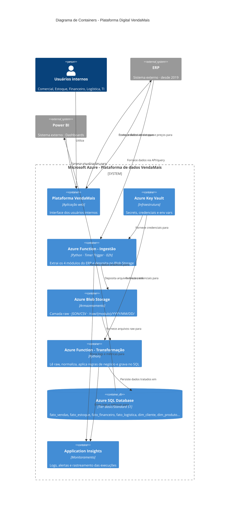

```mermaid
C4Container
    title Diagrama de Containers - Plataforma Digital VendaMais

    Person(usuarios, "Usuários internos", "Comercial, Estoque, Financeiro, Logística, TI")

    System_Ext(erp, "ERP", "Sistema externo · desde 2019")
    System_Ext(powerbi, "Power BI", "Sistema externo · Dashboards")

    System_Boundary(azure, "Microsoft Azure - Plataforma de dados VendaMais") {

        Container(plataforma, "Plataforma VendaMais", "Aplicação web", "Interface dos usuários internos")

        Container(keyvault, "Azure Key Vault", "Infraestrutura", "Secrets, credenciais e env vars")

        Container(fn_ingestao, "Azure Function - Ingestão", "Python · Timer Trigger · 02h", "Extrai os 4 módulos do ERP e deposita no Blob Storage")

        Container(blob, "Azure Blob Storage", "Armazenamento", "Camada raw · JSON/CSV · /raw/{modulo}/YYYY/MM/DD/")

        Container(fn_transform, "Azure Function - Transformação", "Python", "Lê raw, normaliza, aplica regras de negócio e grava no SQL")

        ContainerDb(sql, "Azure SQL Database", "Tier Basic/Standard S1", "fato_vendas, fato_estoque, fato_financeiro, fato_logistica, dim_cliente, dim_produto...")

        Container(appinsights, "Application Insights", "Monitoramento", "Logs, alertas e rastreamento das execuções")
    }

    Rel(usuarios, plataforma, "Utiliza")
    Rel(plataforma, erp, "Envia pedidos/vendas para")
    Rel(erp, plataforma, "Fornece dados de estoque e preços para")

    Rel(erp, fn_ingestao, "Fornece dados via API/query")
    Rel(fn_ingestao, blob, "Deposita arquivos brutos em")
    Rel(blob, fn_transform, "Fornece arquivos raw para")
    Rel(fn_transform, sql, "Persiste dados tratados em")
    Rel(sql, powerbi, "Fornece dados analíticos para")
    Rel(powerbi, plataforma, "Fornece visualizações para")

    Rel(keyvault, fn_ingestao, "Fornece credenciais para", $tags="infra")
    Rel(keyvault, fn_transform, "Fornece credenciais para", $tags="infra")
    Rel(fn_ingestao, appinsights, "Envia logs e métricas para", $tags="infra")
    Rel(fn_transform, appinsights, "Envia logs e métricas para", $tags="infra")
```
